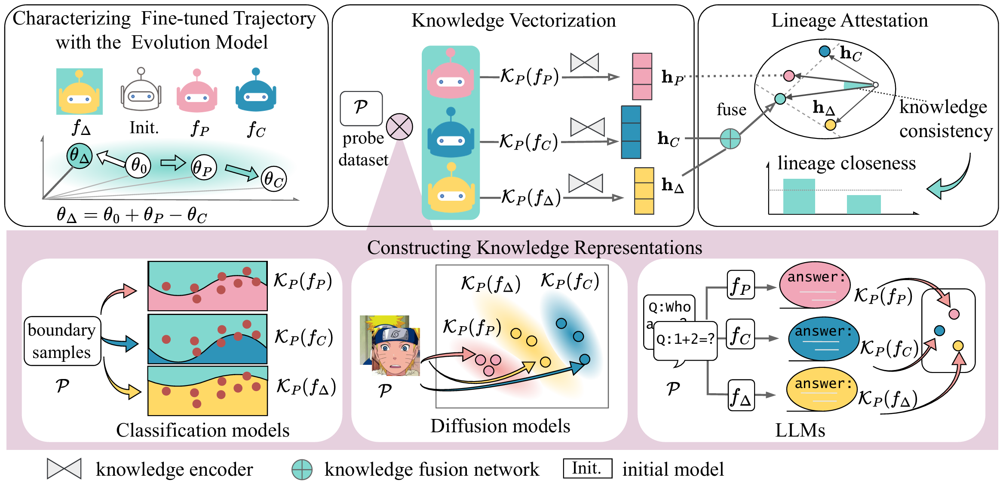

# Attesting Model Lineage by Consisted Knowledge Evolution with Fine-Tuning Trajectory

This repository contains the official implementation for the paper **"Attesting Model Lineage by Consisted Knowledge Evolution with Fine-Tuning Trajectory"**.

## Table of Contents

- [Abstract](#-abstract)-[Methodology](#-methodology)
- [Environment Setup](#️-environment-setup)
- [Quick Start](#-quick-start-reviewer-mode)
- [Full Reproduction Pipeline](#-full-reproduction-pipeline)
  - [Project Structure](#-project-structure)
  - [Small Models](#1-small-models-mobilenet--resnet)
  - [Large Language Models](#2-large-language-models-llm)
  - [Diffusion Models](#3-diffusion-models)
- [Configuration](#-configuration)
- [Adaptive Attacks](#️-adaptive-attacks-evaluation)
- [Baseline Comparisons](#-baseline-comparisons)
- [Citation](#-citation)

---

## 📄 Abstract

The fine-tuning technique in deep learning gives rise to an emerging lineage relationship among models. This lineage provides a promising perspective for addressing security concerns such as unauthorized model redistribution and false claim of model provenance, that are particularly pressing in open-source model libraries where robust lineage verification mechanisms are often lacking. Existing approaches to model lineage detection primarily rely on static architectural similarities, which are insufficient to capture the dynamic evolution of knowledge that underlies true lineage relationships. Drawing inspiration from the genetic mechanism of human evolution, we tackle the problem of model lineage attestation by verifying the joint trajectory of knowledge evolution and parameter modification. To this end, we propose a novel model lineage attestation framework. In our framework, model editing is first leveraged to quantify parameter-level changes introduced by fine-tuning. Subsequently, we introduce a novel knowledge vectorization mechanism that refines the evolved knowledge within the edited models into compact representations by the assistance of probe samples. These embeddings serve as the foundation for verifying the arithmetic consistency of knowledge relationships across models, thereby enabling robust attestation of model lineage. Extensive experimental evaluations demonstrate the effectiveness and resilience of our approach in a variety of adversarial scenarios in the real world. Our method consistently achieves reliable lineage verification across a broad spectrum of model types, including vision classifiers, diffusion models, and large language models.

<div align="center">
  
</div>


## 🧩 Methodology

Our approach attests model lineage by verifying the consistency between the **Fine-Tuning Trajectory** and the **Knowledge Evolution Path**.

### 1. Knowledge Vectorization

We introduce a mechanism to vectorize the "knowledge" contained within a model. By extracting feature embeddings from specific layers (e.g., the last convolutional layer of MobileNet/ResNet or the hidden states of LLMs) on a set of probe samples, we construct a high-dimensional representation of the model's knowledge state.

### 2. Knowledge Evolution & Trajectory

When a parent model $M_P$ is fine-tuned to a child model $M_C$, the knowledge evolves. We model this evolution as a vector transformation in the latent space. The "Fine-Tuning Trajectory" represents the path taken during the optimization process.

### 3. Lineage Attestation

We train a **Lineage Detector** (a Transformer-based encoder followed by a Relation Network) to learn the mapping between the parent and child knowledge vectors. The detector predicts whether a given pair $(M_P, M_C)$ constitutes a valid lineage by checking if the observed knowledge evolution is consistent with a legitimate fine-tuning trajectory. This method is robust against model obfuscation and independent retraining.

## 🛠️ Environment Setup

### Requirements

- **OS**: Linux (validated on Ubuntu 20.04/22.04)
- **Python**: 3.10+ (Recommended 3.12)
- **GPU**: NVIDIA GPU with CUDA support (A100 80GB recommended for LLM&Diffusion experiments)

### Installation

1. **Clone the repository**

   ```bash
   git clone https://github.com/Tthvic/Model_lineage.git
   cd Model_lineage
   ```

2. **Create a Conda environment**

   ```bash
   conda create -n lineage python=3.12 -y
   conda activate lineage
   ```

3. **Install dependencies**

   ```bash
   pip install -r requirements.txt
   ```

## 🚀 Quick Start (Reviewer Mode)

For reviewers or users who want to quickly verify the results using our pre-generated embeddings, we provide a **"Reviewer Mode"** for different model types.

### Small Models (MobileNet & ResNet)

#### Prerequisites

Ensure you have the following files in place (provided in the supplementary material):

- **MobileNet Checkpoint**: `data/embeddings/small_model/test_M_data.pth`
- **ResNet Checkpoint**: `data/embeddings/small_model/test_R_data.pth`

#### 1. Evaluate MobileNet Lineage (Test M)

Evaluates the lineage detector trained on MobileNet features (dim=1280).

```bash
python scripts/small_model/train_lineage.py \
    --evaluate \
    --model_arch mobilenet \
    --checkpoint data/models/small_model/mobilenet_model.pth \
    --data_dir data/embeddings/small_model/test_M_data.pth
```

#### 2. Evaluate ResNet Lineage (Test R)

Evaluates the lineage detector trained on ResNet features (dim=512).

```bash
python scripts/small_model/train_lineage.py \
    --evaluate \
    --model_arch resnet \
    --checkpoint data/models/small_model/resnet_model.pth \
    --data_dir data/embeddings/small_model/test_R_data.pth
```

### Large Language Models (LLM)

We provide pre-generated embeddings for **Qwen-1.5B** models to enable quick testing of the lineage detection system.

#### Prerequisites

The embeddings are already included in the repository at:
- `data/embeddings/llm/Qwen-1.5B/`

This directory contains:
- `Qwen_Instruct/`: Parent model (Instruct) embeddings
- `Finetune/`, `Adapter/`, `Merge/`: Child model embeddings
- `B-A/`: Parameter difference embeddings
- `Qwen_random/`: Negative sample embeddings

#### Train and Test Lineage Detector

Train the lineage detector on Qwen-1.5B embeddings:

```bash
python scripts/llm/qwen_knowledge_relation_training.py
```

### Diffusion Models

**Note:** Due to the large size of diffusion model embeddings (derived from a probe set of 1,000 images), we do not provide a Quick Start mode (which relies on pre-generated embeddings) for diffusion experiments. Please follow the [Full Reproduction Pipeline](#3-diffusion-models) for detailed instructions.

---

## 🔬 Full Reproduction Pipeline

This section details how to reproduce the experiments from scratch for all model types.

<!-- ### 📂 Project Structure

```
.
├── adaptive_attacks/              # 🛡️ Adaptive attack implementations
│   ├── README.md                  # Attack overview and documentation
│   ├── llm/                       # LLM adaptive attacks
│   │   ├── knowledge_overwriting/ # Knowledge overwriting attack
│   │   ├── knowledge_infusion/    # Knowledge infusion attack
│   │   ├── weight_perturbation/   # Weight noise perturbation (deprecated)
│   │   └── weight_prune/          # Weight pruning attack
│   └── classification_model/      # Vision model adaptive attacks
│       ├── dataset_utils.py       # Shared data loading utilities
│       ├── knowledge_overwriting/ # Label shuffling attack
│       ├── weight_prune/          # Weight prune attack
│       ├── paramerpertur/         # Parameter perturbation
│       └── Structure_Evasion/     # Structure evasion attack
├── configs/                       # Configuration files for all experiments
│   ├── llm/                       # LLM configs (Qwen, Llama, Mistral, Gemma, Phi)
│   │   ├── qwen2_5.yaml           # Qwen 2.5 family configuration
│   │   ├── llama3.yaml            # Llama 3 family configuration
│   │   ├── mistral.yaml           # Mistral family configuration
│   │   ├── gemma.yaml             # Gemma family configuration
│   │   ├── phi4.yaml              # Phi-4 family configuration
│   │   └── qwen3.yaml             # Qwen 3 family configuration
│   ├── small_model/               # Vision model configs
│   │   └── mobilenet_caltech.yaml # MobileNet/ResNet config
│   └── diffusion_config.yaml      # Diffusion model config
├── data/                          # Data root directory
│   ├── datasets/                  # Raw datasets
│   │   ├── coco/                  # COCO dataset for diffusion experiments
│   │   ├── caltech101/            # Caltech-101 dataset
│   │   ├── mmlu/                  # MMLU benchmark
│   │   ├── gsm8k/                 # GSM8K math reasoning
│   │   ├── hellaswag/             # HellaSwag commonsense reasoning
│   │   ├── humaneval/             # HumanEval code generation
│   │   ├── arc_challenge/         # ARC challenge
│   │   └── mgsm/                  # Multilingual GSM
│   ├── models/                    # Model weights and checkpoints
│   │   ├── llm/                   # LLM model checkpoints
│   │   ├── small_model/           # Vision model checkpoints
│   │   └── diffusion/             # Diffusion model checkpoints
│   ├── embeddings/                # Extracted knowledge vectors
│   │   ├── llm/                   # LLM embeddings
│   │   ├── small_model/           # Vision model embeddings
│   │   └── diffusion/             # Diffusion model U-Net features
│   └── intermediate/              # Intermediate processing data
│       └── llm/                   # LLM intermediate outputs
├── scripts/                       # Execution scripts for experiments
│   ├── llm/                       # LLM experiment scripts
│   │   ├── download_datasets.py   # Download LLM evaluation datasets
│   │   ├── download_models.py     # Download LLM models from HuggingFace
│   │   ├── generate_answers.py    # Generate model outputs
│   │   ├── generate_embeddings.py # Extract knowledge embeddings
│   │   └── train_lineage.py       # Train lineage detector
│   ├── small_model/               # Vision model experiment scripts
│   │   ├── train_models.py        # Train parent/child models
│   │   ├── generate_embeddings.py # Extract feature embeddings
│   │   ├── train_lineage.py       # Train lineage detector
│   │   ├── train_lineage_5samples.py  # Train with 5-sample support
│   │   ├── eval_demo.py           # Evaluation demo
│   │   ├── run_demo.py            # Quick demo script
│   │   └── prune_model.py         # Model pruning utility
│   └── diffusion/                 # Diffusion model experiment scripts
│       ├── download_datasets.py   # Download COCO dataset
│       ├── generate_embeddings.py # Extract U-Net features
│       ├── train_lineage.py       # Train lineage detector
│       ├── test_lineage.py        # Test lineage detection
│       ├── test_adaptive_attack.py    # Test adaptive attacks
│       ├── test_unrelated_dataset.py  # Test on CIFAR-10
│       └── README.md              # Diffusion experiments guide
├── src/                           # Source code for models and utilities
│   ├── llm/                       # LLM-specific modules
│   │   ├── lineage_model.py       # LLM lineage detector
│   │   ├── networks.py            # Transformer encoder & relation networks
│   │   ├── dataset.py             # LLM embedding dataset
│   │   └── loss.py                # Loss functions
│   ├── small_model/               # Vision model modules
│   │   ├── lineage_model.py       # Vision lineage detector
│   │   ├── networks.py            # MLP/Transformer networks
│   │   ├── dataset.py             # Vision embedding dataset
│   │   └── loss.py                # Triplet & contrastive losses
│   └── diffusion/                 # Diffusion model modules
│       ├── lineage_model.py       # Diffusion lineage detector
│       ├── networks.py            # Encoder & relation networks
│       ├── loss.py                # Cosine embedding & triplet losses
│       ├── task_vectors.py        # Task vector computation
│       ├── diffusion_dataset.py   # COCO feature dataset
│       └── dataset_with_attacks.py    # Dataset with attack augmentations
└── Baselines/                     # Baseline comparison methods
    └── KRMandIPGUAR/              # KRM and IPGuard implementations
        ├── Dataset_inference/      # Dataset inference attack
        └── IPGuard/                # IPGuard watermarking
``` -->

### 1. Small Models (MobileNet / ResNet)

Experiments on Caltech-101, Tiny-ImageNet, etc.

**Step 1: Train Parent and Child Models**
Trains the base models and fine-tuned variants to establish the lineage ground truth.

```bash
python scripts/small_model/train_models.py --config configs/small_model/mobilenet_caltech.yaml
```

**Step 2: Generate Knowledge Fingerprints**
Extracts feature embeddings (knowledge vectors) from the trained models.

```bash
python scripts/small_model/generate_embeddings.py --config configs/small_model/mobilenet_caltech.yaml --split train
python scripts/small_model/generate_embeddings.py --config configs/small_model/mobilenet_caltech.yaml --split test
```

**Step 3: Train Lineage Detector**
Trains the Transformer/MLP-based detector to distinguish lineage relationships.

```bash
python scripts/small_model/train_lineage.py --config configs/small_model/mobilenet_caltech.yaml
```

**Step 4: Evaluation**
Evaluate the trained detector on test sets with different category relationships (parent-child, grandparent-child, non-related).

```bash
python scripts/small_model/eval_demo.py
```

### 2. Large Language Models (LLM)

Experiments on Qwen-2.5, Llama-3, Mistral, Gemma, Phi-4 using datasets like GSM8K, MMLU, HellaSwag, HumanEval.

**Step 1: Download Models & Datasets**

```bash
# Download Base/Instruct models from HuggingFace
python scripts/llm/download_models.py --config configs/llm/qwen2_5.yaml

# Download evaluation datasets (GSM8K, MMLU, HellaSwag, etc.)
python scripts/llm/download_datasets.py --config configs/llm/qwen2_5.yaml
```

**Step 2: Generate Model Outputs (Answers)**
Generates responses from Parent (Instruct), Child (Fine-tuned), and Independent models.

```bash
# Generate for Fine-tuned models (Child)
python scripts/llm/generate_answers.py --config configs/llm/qwen2_5.yaml --type finetune

# Generate for Instruct models (Parent)
python scripts/llm/generate_answers.py --config configs/llm/qwen2_5.yaml --type instruct
```

**Step 3: Extract Knowledge Embeddings**
Converts model outputs into knowledge vectors using embedding models.

```bash
python scripts/llm/generate_embeddings.py --config configs/llm/qwen2_5.yaml --type finetune
python scripts/llm/generate_embeddings.py --config configs/llm/qwen2_5.yaml --type instruct
```

**Step 4: Train Lineage Detector**

```bash
python scripts/llm/train_lineage.py --config configs/llm/qwen2_5.yaml
```

**Supported LLM Families:**

- **Qwen 2.5**: `configs/llm/qwen2_5.yaml`
- **Llama 3**: `configs/llm/llama3.yaml`
- **Mistral**: `configs/llm/mistral.yaml`
- **Gemma**: `configs/llm/gemma.yaml`
- **Phi-4**: `configs/llm/phi4.yaml`
- **Qwen 3**: `configs/llm/qwen3.yaml`

### 3. Diffusion Models

Experiments on Stable Diffusion models with various artistic style fine-tuning using COCO dataset.

Our diffusion model lineage detection extracts features from the U-Net's intermediate layers (specifically Cross-Attention UpBlock features) to capture the knowledge evolution during fine-tuning.

**Step 0: Download COCO Dataset**
Download COCO 2014 training images and annotations (~13.2GB total).

```bash
python scripts/diffusion/download_datasets.py
```

This will download:

- COCO train2014 images (~13GB)
- Annotations including captions (~241MB)
- Extract to `data/datasets/coco/`

**Step 1: Generate Embeddings**
Extracts U-Net features from parent and child diffusion models using COCO images as probe samples.

```bash
python scripts/diffusion/generate_embeddings.py
```

This script:

- Loads parent model (e.g., Stable Diffusion 2-base)
- Loads child model (e.g., fine-tuned on specific artistic style)
- Extracts U-Net Cross-Attention UpBlock2D features (320 channels, 32x32)
- Saves embeddings to `data/embeddings/diffusion/`

**Step 2: Train Lineage Detector**
Trains the lineage detector using cosine embedding loss and triplet loss.

```bash
python scripts/diffusion/train_lineage.py
```

The detector learns to:

- Encode U-Net features into 320-dimensional vectors
- Predict child knowledge from parent + task vector
- Distinguish true lineage pairs from negative samples

**Step 3: Test Lineage Detection**
Tests the trained detector on different model pairs.

```bash
python scripts/diffusion/test_lineage.py
```

**Adaptive Attack Testing and unrelated_dataset Testing**

Test robustness against parameter perturbation and model pruning attacks:

```bash
# Test against poisoned images (adaptive attack)
python scripts/diffusion/test_adaptive_attack.py

# Test against unrelated dataset (CIFAR-10)
python scripts/diffusion/test_unrelated_dataset.py
```

**Key Features:**

- `test_adaptive_attack.py`: Tests detector on poisoned/attacked model embeddings using specific trigger samples
- `test_unrelated_dataset.py`: Evaluates detector on CIFAR-10 images to verify it doesn't produce false positives on out-of-distribution data
- Parameter perturbation and pruning attacks are implemented in `src/diffusion/dataset_with_attacks.py`

The diffusion experiments demonstrate that our method is robust to:

- Gaussian noise addition to model parameters (up to 20% noise ratio)
- Model pruning (up to 60% sparsity)
- Different probe datasets (COCO vs CIFAR-10)

## 📊 Configuration

All experiments are driven by YAML configuration files in the `configs/` directory.

### Small Model Configurations

**`configs/small_model/mobilenet_caltech.yaml`**: Settings for MobileNet/ResNet on Caltech-101

  - Batch size, learning rate, dataset paths
  - Model architectures (MobileNetV2, ResNet18)
  - Feature dimensions and embedding sizes

### LLM Configurations

Settings for various LLM families with model paths, evaluation tasks, and adapter configurations:

- **`configs/llm/qwen2_5.yaml`**: Qwen 2.5 family
  - Evaluation tasks: GSM8K, MMLU, HellaSwag, HumanEval
  - Fine-tuning adapters for different domains
- **`configs/llm/llama3.yaml`**: Llama 3 family
- **`configs/llm/mistral.yaml`**: Mistral family
- **`configs/llm/gemma.yaml`**: Gemma family
- **`configs/llm/phi4.yaml`**: Phi-4 family
- **`configs/llm/qwen3.yaml`**: Qwen 3

### Diffusion Model Configurations

**`configs/diffusion_config.yaml`**: Settings for Stable Diffusion lineage detection

  - Parent/child model pairs
  - U-Net feature extraction layers
  - Training hyperparameters

### Key Configuration Parameters

```yaml
# Example: configs/llm/qwen2_5.yaml
model:
  base_model: "Qwen/Qwen2.5-1.5B"
  instruct_model: "Qwen/Qwen2.5-1.5B-Instruct"
  adapters:
    - "Qwen/Qwen2.5-Math-1.5B-Instruct"
    - "Qwen/Qwen2.5-Coder-1.5B-Instruct"

tasks:
  - name: "gsm8k"
    eval_split: "test"
  - name: "mmlu"
    eval_split: "validation"

training:
  batch_size: 32
  learning_rate: 1e-4
  epochs: 50
```

---

## 🛡️ Adaptive Attacks Evaluation

We provide comprehensive adaptive attack implementations to test the robustness of our lineage attestation framework. These attacks simulate adversarial scenarios where attackers attempt to hide or obfuscate model lineage.

### Attack Categories

#### 1. Large Language Model (LLM) Adaptive Attacks

**Knowledge Overwriting Attack**

- **Scenario**: Attacker uses a different model (e.g., Llama-3.1-8B-Instruct) to generate answers for test questions, then fine-tunes the target model (e.g., Qwen2.5-1.5B-Policy2) with these answers.
- **Location**: [`adaptive_attacks/llm/knowledge_overwriting/`](adaptive_attacks/llm/knowledge_overwriting/)

```bash
cd adaptive_attacks/llm/knowledge_overwriting
```

**Knowledge Infusion Attack**

- **Scenario**: Inject new task-specific knowledge while attempting to hide lineage relationship
- **Location**: [`adaptive_attacks/llm/knowledge_infusion/`](adaptive_attacks/llm/knowledge_infusion/)

```bash
cd adaptive_attacks/llm/knowledge_infusion
```

**Weight Pruning Attack**

- **Scenario**: Apply magnitude-based pruning to lineage detector to test robustness under model compression
- **Pruning Ratios**: 0%, 20%, 30%, 50%, 70%
- **Location**: [`adaptive_attacks/llm/weight_prune/`](adaptive_attacks/llm/weight_prune/)

```bash
cd adaptive_attacks/llm/weight_prune
```

#### 2. Vision Model Adaptive Attacks (Classification Models)

**Knowledge Overwriting Attack**

- **Scenario**: Train fine-tuned model with randomly shuffled labels to overwrite learned representations
- **Location**: [`adaptive_attacks/classification_model/knowledge_overwriting/`](adaptive_attacks/classification_model/knowledge_overwriting/)

```bash
cd adaptive_attacks/classification_model/knowledge_overwriting
```

**Parameter Perturbation Attack**

- **Scenario**: Systematic parameter-level perturbations to test detector robustness
- **Location**: [`adaptive_attacks/classification_model/paramerpertur/`](adaptive_attacks/classification_model/paramerpertur/)

**Structure Evasion Attack**

- **Scenario**: Architectural modifications to evade lineage detection
- **Location**: [`adaptive_attacks/classification_model/Structure_Evasion/`](adaptive_attacks/classification_model/Structure_Evasion/)